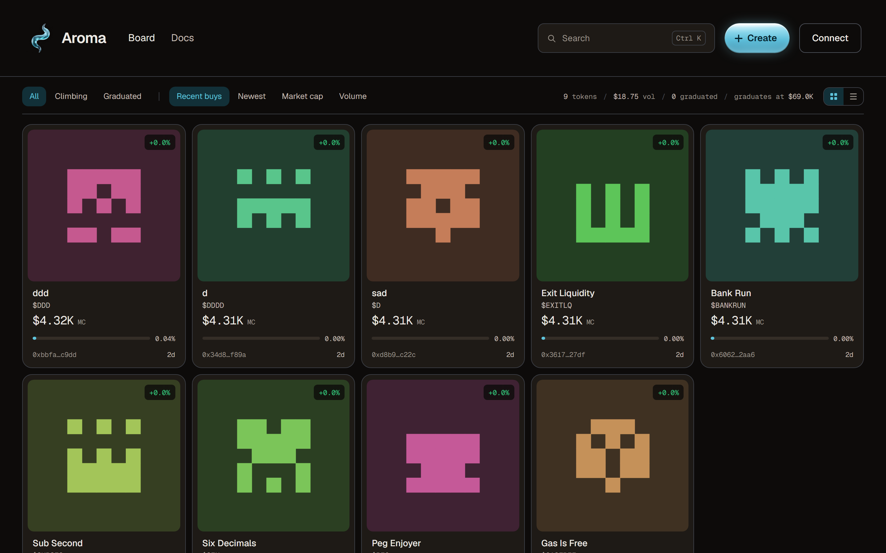

<div align="center">

# Aroma

**A bonding-curve launchpad on [Arc](https://arc.network), Circle's L1 — where USDC is the gas token, so every price is already a dollar.**

[aroma.money](https://aroma.money) · [Docs](https://aroma.money/docs) · [@Aromadotmoney](https://x.com/Aromadotmoney)



</div>

---

Anyone can launch a coin in one transaction. It trades immediately against a
bonding curve — no liquidity to provide, no pool to seed, nothing to
configure. When enough has been raised the coin graduates: the curve closes
and the proceeds seed a Uniswap v4 pool whose liquidity is locked forever.

## Why Arc changes the design

Most launchpads price coins in a volatile asset. A coin "up 40%" might mean
the coin moved, or the quote asset moved, and a trader has to hold two prices
in their head to know which.

Arc uses **USDC as its native gas token**. The asset you pay fees with and the
asset you price in are the same dollar-denominated stablecoin, which changes
real things rather than just the marketing:

- **Prices are dollars, not ratios.** A $69,000 market cap is $69,000 — no
  conversion, no second asset moving underneath it.
- **Buying is one transaction.** Native USDC arrives as `msg.value`, so there
  is no ERC-20 approval step before a buy. Selling is one transaction too,
  via an EIP-2612 permit signed in the same click.
- **The graduated pool needs no wrapper.** Uniswap v4 supports native
  currency directly, so the pool is `token / native USDC` with no WETH-style
  wrapped contract in between — something v2 and v3 could not express.
- **Decimals are the sharp edge.** Native USDC is 18 decimals while its ERC-20
  interface is 6. All curve math is done in 18 and converted only at display
  boundaries, with fuzz tests aimed specifically at that conversion.

## How a coin works

```
launch ─────────▶ bonding curve ─────────▶ graduation ─────────▶ Uniswap v4
1B minted         price rises as           at $13,800 raised     locked forever
no mint fn        people buy               / $69,000 mcap
```

A launch mints **1,000,000,000** tokens with no mint function and no admin key
over the coin. 800,000,000 sell through a constant-product curve with virtual
reserves; the remaining 200,000,000 are held back to seed the pool at
graduation, at exactly the price the curve closed at.

Trades pay **1%**, split 70/30 to the coin's creator and the protocol.

Creators can switch on a **launch tax** for the opening seconds — it starts at
up to 99% and decays to zero across at most 3 seconds, which makes sniping a
launch unprofitable without being a tool for anything else. The contract
rejects a longer window or a higher rate, and creators can exempt named
wallets.

**Nobody can pull the liquidity, including us.** While a coin is on the curve
the USDC sits in `CurveManager`; at graduation it moves into `LiquidityLocker`,
which has no withdraw function of any kind. A creator can still sell their own
holdings, which is shown on the coin's page alongside the fees they have
earned.

## Stack

| Layer | Choice | Why |
| --- | --- | --- |
| Web | Next.js 16 (App Router), React, TypeScript | Server-rendered coin pages so crawlers and unfurlers see real content |
| Styling | Tailwind v4 with `@theme` tokens | One palette, no component library, no generated-looking UI |
| Wallet | wagmi + viem + Reown AppKit | Wallet-first; social login is a config flip later, not a rebuild |
| Contracts | Foundry, Solidity 0.8.28 | `forge test --fuzz` is the right tool for the decimal boundary |
| Indexer | Goldsky subgraph (AssemblyScript) | Prices, trades, holders and candles, precomputed rather than aggregated per query |
| Live data | Server-sent events over one shared poller | One upstream poll feeds every viewer, so load is flat in the number of tabs |
| Media | IPFS via Pinata, `sharp`-normalised | Coin images outlive us |
| Hosting | Docker on Railway, Cloudflare in front | One long-lived process — see [DEPLOY.md](DEPLOY.md) |

## Decisions worth explaining

**One `CurveManager`, not a contract per coin.** Every curve lives in one
contract with per-token state in a mapping. Cheaper at volume, one audit
surface instead of N — and it means anyone indexing or integrating Aroma
watches a single address with a single log filter, rather than discovering a
new contract per coin.

**Virtual reserves, so a fresh coin is never worth zero.** The curve is a
constant product seeded with reserves that do not exist, which sets the
opening market cap at $4,312.50 and makes the run to graduation a clean 16x.
Both reserve constants are derived by a script, not hand-tuned.

**SSE rather than WebSockets.** The data is one-directional — the server has
news, the client never talks back. SSE rides ordinary HTTP, so proxies and
CDNs need no special handling and browsers reconnect on their own.

**A single process, deliberately.** The live tape is one poller shared by
every connected viewer, which serverless cannot hold and replicas would
duplicate. The tradeoffs are written down in [DEPLOY.md](DEPLOY.md).

**Numbers live in one place.** `src/lib/arc.ts` holds the curve constants, and
the contracts, the UI, the docs page and the structured data all read from
them. Documentation that can drift from the code eventually does.

## Repo

```
src/app          routes, API handlers, metadata
src/components   UI
src/lib          chain config, curve constants
src/lib/server   subgraph client, IPFS, rate limiting, live poller
contracts/       Foundry workspace — see contracts/README.md
subgraph/        Goldsky subgraph
```

## Deployed on Arc testnet

Chain 5042002. All verified on Arcscan; addresses live in
[`src/lib/arc.ts`](src/lib/arc.ts).

| Contract | Address |
| --- | --- |
| CurveManager | `0xEF036a1167e307b413a7F79AFC7d6A774Df8AC07` |
| AromaFactory | `0xc11f086E1e45b3589b1F2B95FA8069Bc2a58D772` |
| LiquidityLocker | `0xeb80Abd167739E93393935863f035C94f8B667fF` |

61 contract tests pass, including an invariant run over 128,000 calls
asserting the curve stays solvent, never oversells, and that graduation is
irreversible. Graduation is tested against Uniswap's real `PoolManager`
deployed in-process — not a mock.

## Public APIs

Both documented at [aroma.money/docs](https://aroma.money/docs).

**Read** — `/api/dex/*` is an unauthenticated feed of curve trading, shaped
the way DEX Screener's indexer polls: `latest-block`, `asset`, `pair`, and
`events` over a block range. Coins on a curve are invisible to every screener
in the market, because the trades happen inside a contract no one has an
adapter for. This exists so anyone can index Aroma without asking us.

**Write** — `CurveManager` directly. `buy`, `sell`, and on-chain
`quoteBuy`/`quoteSell` so integrators never reimplement the curve math.

## Status

Live on Arc testnet. **Arc mainnet launches 2026-09-16** — coins here trade in
test funds and are worth nothing until then.

How it is deployed is written up in [DEPLOY.md](DEPLOY.md), including why it
runs as a single process. The contract workspace has its own notes in
[contracts/README.md](contracts/README.md).
